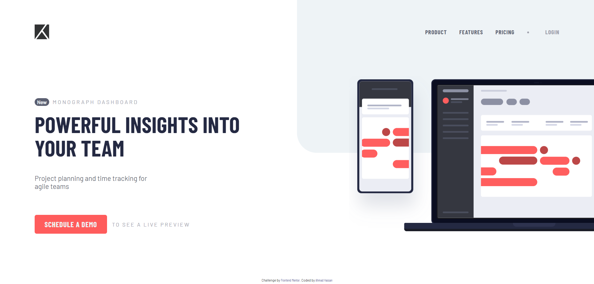

# Project Tracking Intro Component👨‍💻

## Project Overview 🌟

This is a front-end coding challenge completed for [Frontend Mentor](https://www.frontendmentor.io). The challenge was to build a project tracking intro component and make it look as close to the provided design as possible.

## Technologies Used 💻

- HTML
- CSS

### The Challenge 📋

Users should be able to:

- View the optimal layout for the site depending on their device's screen size
- See hover states for all interactive elements on the page
- Create the background shape using code

## Screenshots 📷

| Mobile                                            | Desktop                                            |
| ------------------------------------------------- | -------------------------------------------------- |
|              |              |

## Live Demo 🚀

You can view the live demo of the project [here](https://project-tracking-intro-component-js6.netlify.app/).